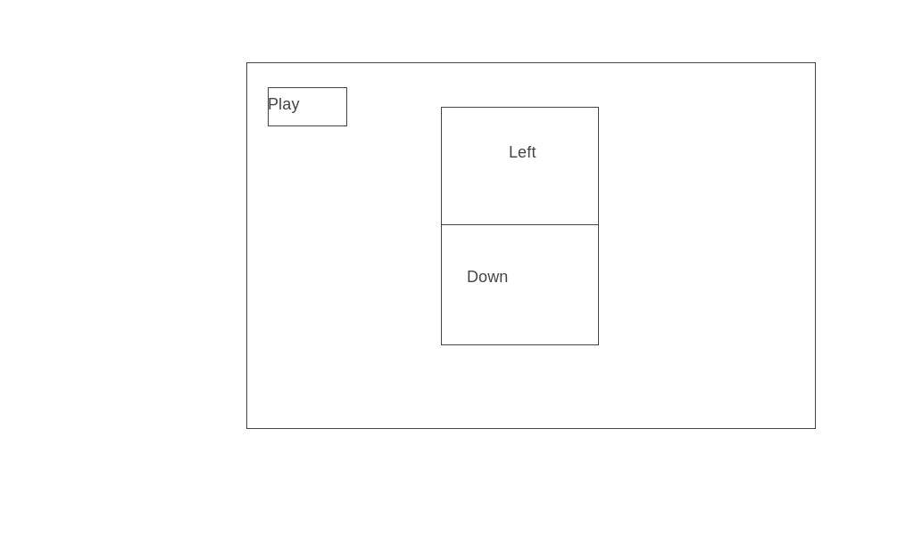
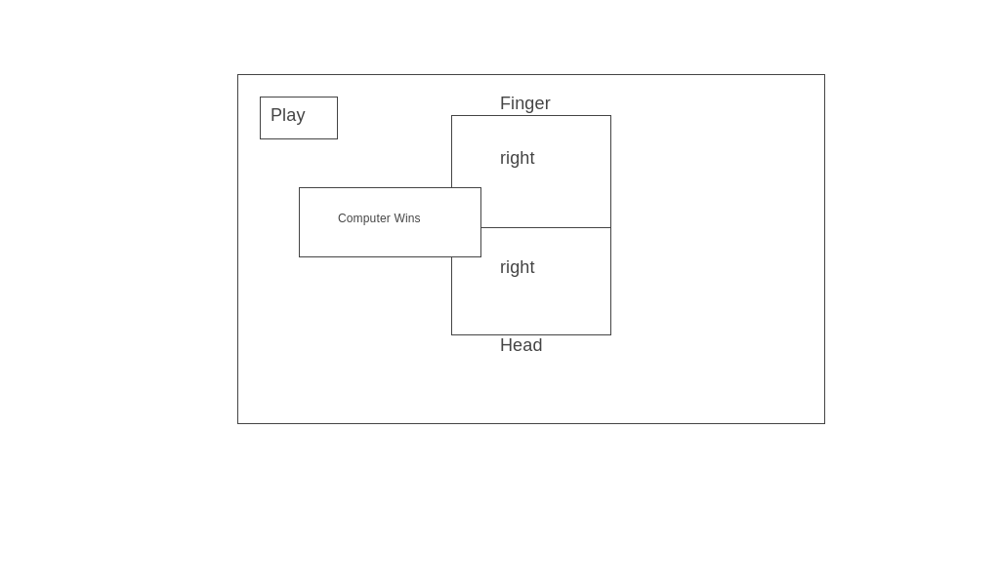
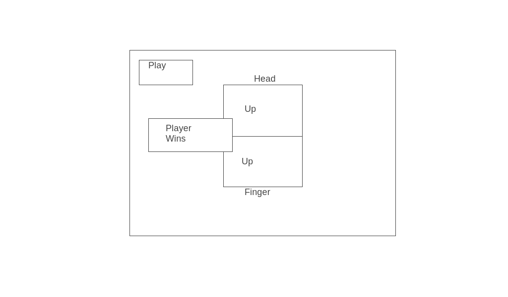

# FINGER-HEAD GAME
---
## Purpose
---
##### The Finger-Head game is a fun activity to do with your friends. However, if you're not around your friends, you can now play it in this browser version of the game.
##### Harness your quickdraw prowess(or quickclick as the case may be) and challenge your electronic opponent.
###### The [irl game](https://www.youtube.com/watch?v=RDpj-myQTa0) involves two players alternating rounds. One player initially points his finger in a choosen direction up, down, left or right, simultaniously the other player looks swivels his head in a choosen direction up, down, left or right. If the player swiveling his head looks in the direction the player pointing pointed he loses. Otherwise they switch roles, with the head player now becoming the finger pointer and the finger player swiveling his head. Repeating and alternating rounds until one player loses. With the browser version you play against the computer. Inputing your command for directions with the directional keys, you will alternate being the 'finger' first and 'head' with the computer.

## User Stories

######  As a user, I want to play the Finger-Head game on my browser.
* As a user, I want to have a massage to explain the rules of the game
* As a user, I want controls to input my directions.
* As a user, I want my directions and the computers directions to be displayed.
* As a user, I want to know when the computer wins or i win.
* As a user, I want a way way to trigger the next round.
###### Stretch
* As a user I want to keep a count of the victories by the player or electronic opponent.
* As a user I want to see the electronic opponent react to victory or defeat.
* As a user I want a cool animation when I win.

## Wire Frame

## Tech
###### I will use Javascript to impliment the functionality of the game. I will use CSS to style it and HTML to provide the frame work.
